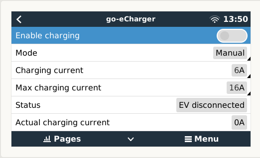
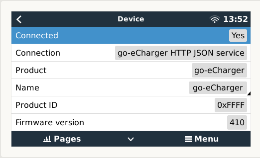
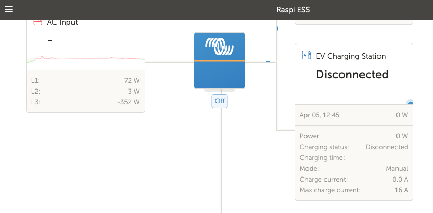
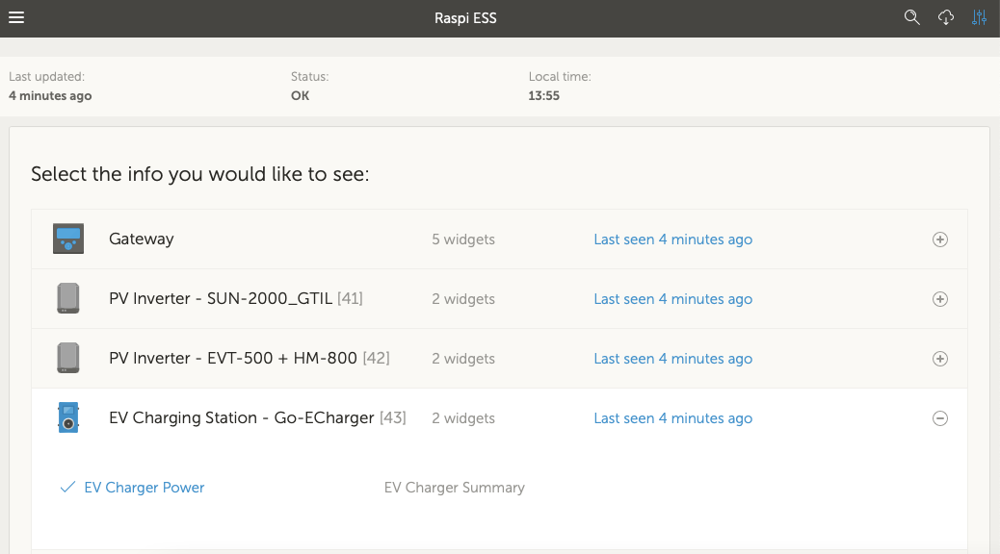

# dbus-goecharger
Integrate go-eCharger into Victron Energies Venus OS

## Purpose
With the scripts in this repo it should be easy possible to install, uninstall, restart a service that connects the go-eCharger to the VenusOS and GX devices from Victron.
Idea is inspired on @fabian-lauer and @trixing project linked below, many thanks for sharing the knowledge:
- https://github.com/fabian-lauer/dbus-shelly-3em-smartmeter
- https://github.com/trixing/venus.dbus-twc3

## How it works
### My setup (only relevant for this script)
- 3-Phase installation
- Venus OS on Raspberry PI 4 4GB version 1.1 - Firmware v2.84
  - No other devices from Victron connected
  - Connected to Wifi netowrk "A"
- go-eCharger hardware version 2
  - Make sure in your go-eCharger app that api v1 is activated
  - Connected to Wifi netowrk "A" with a known IP

### Details / Process
What is the script doing:
- Running as a service
- connecting to DBus of the Venus OS `com.victronenergy.evcharger.http_{DeviceInstanceID_from_config}`
- After successful DBus connection go-eCharger is accessed via REST-API - simply the /status is called and a JSON is returned with all details
  A sample JSON file from Shelly 1PM can be found [here](docs/go-eCharger-status-sample.json)
- Serial/MAC is taken from the response as device serial
- Paths are added to the DBus with default value 0 - including some settings like name, etc
- After that a "loop" is started which pulls go-eCharger data every 750ms from the REST-API and updates the values in the DBus

Thats it 😄

### Restrictions
This script until now only supports reading values from the go-eCharger. Writing values like "Max charging current" and "Charging current" is not possible. Control of go-eCharger by the victron system is not supported for now.


### Pictures
 






## Install & Configuration
### Get the code
Just grap a copy of the main branche and copy them to a folder under `/data/` e.g. `/data/dbus-goecharger`.
After that call the install.sh script.

The following script should do everything for you:
```
wget https://github.com/vikt0rm/dbus-goecharger/archive/refs/heads/main.zip
unzip main.zip "dbus-goecharger-main/*" -d /data
mv /data/dbus-goecharger-main /data/dbus-goecharger
chmod a+x /data/dbus-goecharger/install.sh
/data/dbus-goecharger/install.sh
rm main.zip
```
⚠️ Check configuration after that - because service is already installed an running and with wrong connection data (host) you will spam the log-file

### Change config.ini
Within the project there is a file `/data/dbus-goecharger/config.ini` - just change the values - most important is the deviceinstance under "DEFAULT" and host in section "ONPREMISE". More details below:

| Section  | Config vlaue | Explanation |
| ------------- | ------------- | ------------- |
| DEFAULT  | AccessType | Fixed value 'OnPremise' |
| DEFAULT  | SignOfLifeLog  | Time in minutes how often a status is added to the log-file `current.log` with log-level INFO |
| DEFAULT  | Deviceinstance | Unique ID identifying the shelly 1pm in Venus OS |
| ONPREMISE  | Host | IP or hostname of on-premise Shelly 3EM web-interface |


## Usefull links
- https://github.com/goecharger/go-eCharger-API-v1
- https://github.com/victronenergy/dbus_modbustcp/blob/master/CCGX-Modbus-TCP-register-list.xlsx
- https://github.com/trixing/venus.dbus-twc3

## Discussions on the web
This module/repository has been posted on the following threads:
- https://community.victronenergy.com/questions/128552/go-echarger-integration-in-venus-os.html